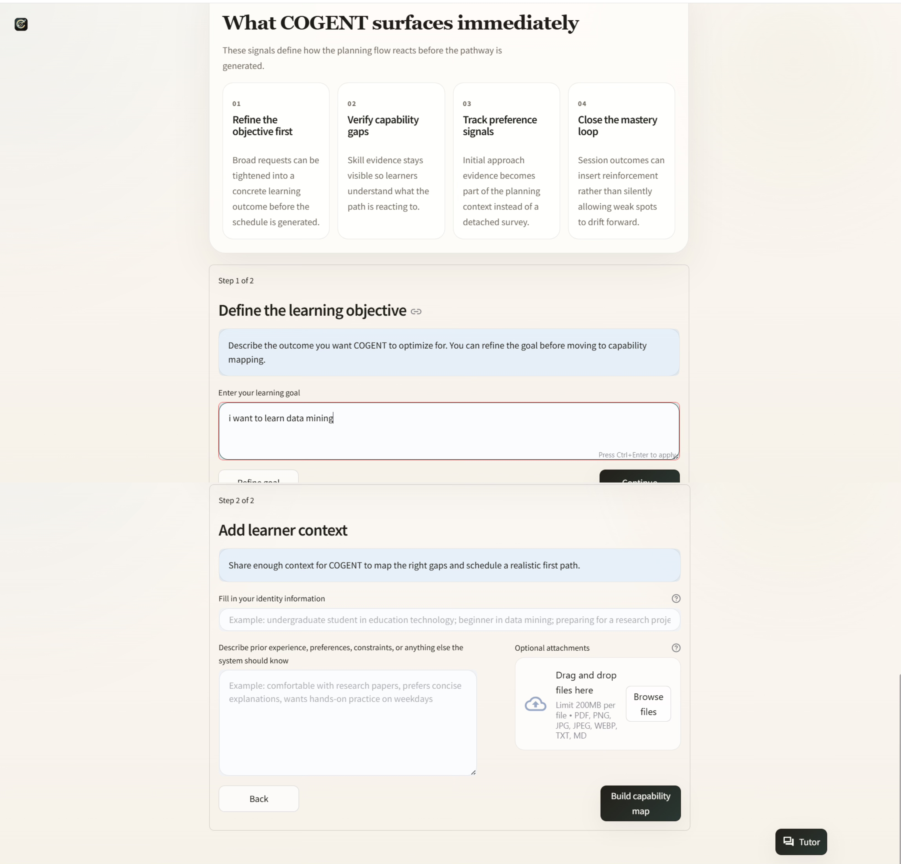
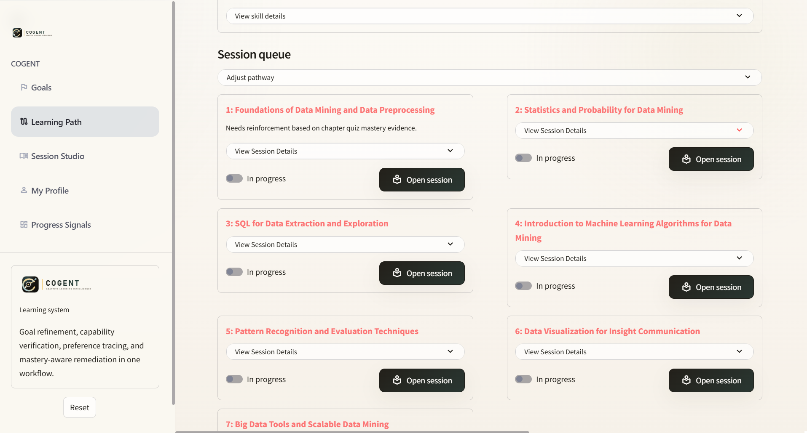
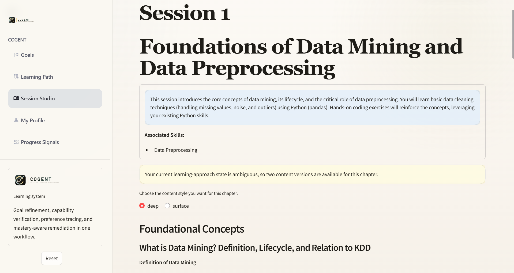
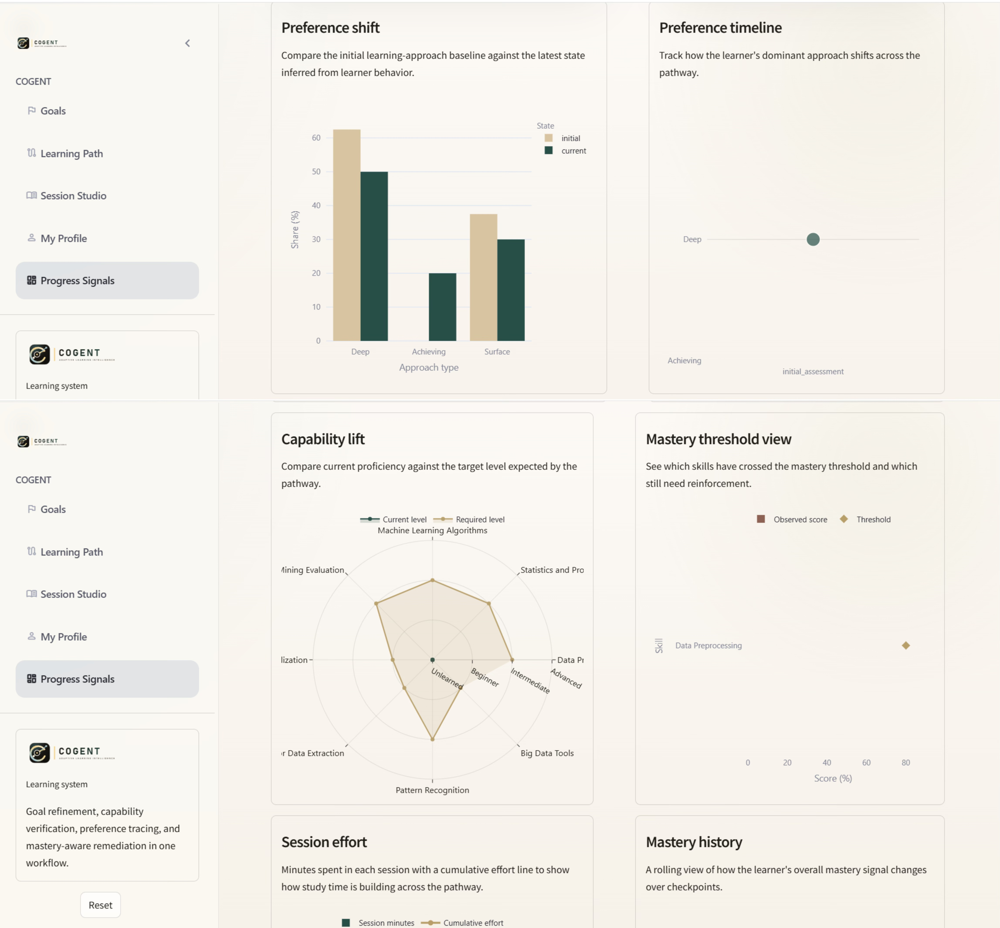

# COGENT

COGENT is an evidence-driven adaptive tutoring system for goal-oriented learning. It refines learner goals, verifies self-reported skills, builds goal-specific learner profiles, schedules adaptive learning paths, generates personalized study documents, and updates future sessions with mastery evidence.

This repository provides the public implementation of the COGENT web prototype described in:

> COGENT: An Evidence-Driven Multi-Agent Tutoring System for Goal-Oriented AI Education

The repository is intended for inspecting and running the system implementation. It is not a complete reproduction package for every experiment in the paper. API credentials, private runtime data, raw participant-level human-study records, and restricted third-party data are not included.

## What COGENT Adds

- Goal-specific learning tracks: each goal keeps its own profile, skill map, path, content, and progress.
- Evidence-calibrated skill gaps: self-reported abilities can trigger diagnostic checks before planning.
- Adaptive learner modeling: learner preferences and behavior are tracked per learning goal.
- Mastery-aware path updates: quiz results can trigger reinforcement or remediation sessions.
- Language-aware generation: generated content follows the learner's input language, including Chinese.

## Project Structure

```text
backend/                  FastAPI service and LLM agents
frontend/                 Streamlit learner interface
resources/                Representative screenshots and framework figures
scripts/                  COGENT Windows service launchers
launch_cogent.cmd         One-click local launcher
```

Research drafts, generated slides, temporary PDFs, local vector stores, and learner runtime data are ignored by default so the GitHub repository stays focused on the application.

## System Screenshots

Representative screenshots of the implemented web prototype are provided below and in `resources/`.

| Goal onboarding | Learning path |
|---|---|
|  |  |

| Personalized content | Dashboard |
|---|---|
|  |  |

## Quick Start On Windows

From the repository root:

```cmd
py -3 -m venv backend\.venv
backend\.venv\Scripts\python.exe -m pip install -r backend\requirements.txt

py -3 -m venv frontend\.venv
frontend\.venv\Scripts\python.exe -m pip install -r frontend\requirements.txt
```

Create `backend\.env` from `backend\.env.example`, then add at least one LLM API key, for example:

```text
DEEPSEEK_API_KEY=your-key
# or
DASHSCOPE_API_KEY=your-qwen-key
# optional alias also supported:
QWEN_API_KEY=your-qwen-key
```

Start the full local system:

```cmd
launch_cogent.cmd
```

COGENT will use:

- Backend API: `http://127.0.0.1:5018/`
- Frontend UI: `http://127.0.0.1:8518/`

## Separate Launch

Start only the backend:

```cmd
scripts\start_cogent_backend.cmd
```

Start only the frontend:

```cmd
scripts\start_cogent_frontend.cmd
```

## Configuration

- Frontend backend target: `frontend/config.py`
- Backend service config: `backend/config/main.yaml`
- Default backend config: `backend/config/default.yaml`
- Local secrets: `backend/.env`

Supported local model options include DeepSeek and Qwen. Qwen uses DashScope's OpenAI-compatible endpoint and reads `DASHSCOPE_API_KEY` or `QWEN_API_KEY`; available Qwen choices include `qwen/qwen-plus` and `qwen/qwen-max`.

Local learner state is written to `frontend/user_data/` and is intentionally ignored by Git.

## Dataset

The paper refers to the following public source dataset:

- [Resume Screening Dataset: 200K Candidates](https://www.kaggle.com/datasets/rhythmghai/resume-screening-dataset-200k-candidates)

Please obtain the dataset from its official page and follow its license and access terms. The public repository does not redistribute the raw dataset. The benchmark cases and experimental evaluation artifacts are not part of this system-only release.

## Documentation

- Backend details: [backend/README.md](backend/README.md)
- Frontend details: [frontend/README.md](frontend/README.md)

## Deployment Notes

COGENT is not a static website. It requires a running FastAPI backend and a Streamlit frontend. For a public web URL, deploy both services to a server or cloud platform and update `frontend/config.py` to point to the deployed backend.
